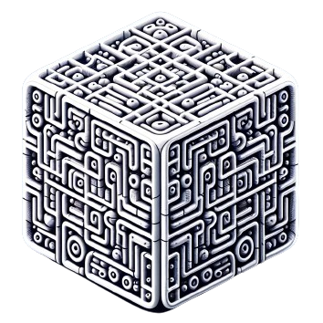
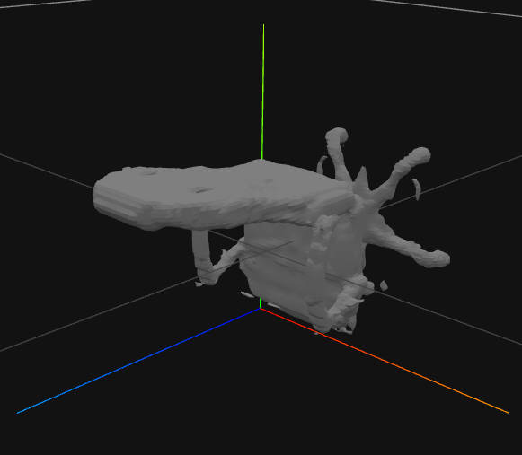

<p align="center">
    <picture>
    
    </picture>
    </br>
    <b>Threefiner</b>
</p>

An interface for text-guided mesh refinement.

https://github.com/ashawkey/threefiner/assets/25863658/01cedb7a-65b1-46cb-92cc-1ca872ac4e72

### Features
* **Mesh in, mesh out**: we support `ply` with vertex colors, `obj`, and single object `glb/gltf` with textures!
* **Easy to use**: both a CLI and a GUI is available.
* **Performant**: Refine your texture in 1 minute with Deepfloyd-IF-II.

### Install

We rely on `torch` and several CUDA extensions, please make sure you install them correctly first!
```bash
# tiny-cuda-nn
pip install git+https://github.com/NVlabs/tiny-cuda-nn/#subdirectory=bindings/torch

# nvdiffrast
pip install git+https://github.com/NVlabs/nvdiffrast

# [optional, will use pysdf if unavailable] cubvh:
pip install git+https://github.com/ashawkey/cubvh
```

To use [Deepfloyd-IF](https://github.com/deep-floyd/IF) models, please log in to your huggingface and accept the [license](https://huggingface.co/DeepFloyd/IF-I-XL-v1.0).

To install this package:
```bash
# install from pypi
# pip install threefiner # not available yet

# install from github
pip install git+https://github.com/ashawkey/threefiner

# local install
git clone https://github.com/ashawkey/threefiner
cd threefiner
pip install .
```

### Usage

```bash
### command line interface
threefiner --help
# this is short for
python -m threefiner.cli --help

### refine a coarse mesh ('input.obj') using Stable-diffusion and save to 'logs/hamburger.glb'
threefiner sd --mesh input.obj --prompt 'a hamburger' --outdir logs --save hamburger.glb

### if the initial texture is good, we recommend using IF2 for refinement.
# by default, it will save to './name_fine.glb'
threefiner if2 --mesh name.glb --prompt 'description'

### if the initial texture is not good, we recommend using SD or IF first.
threefiner sd --mesh name.glb --prompt 'description'
threefiner if --mesh name.glb --prompt 'description'

### if the initial geometry is good, you can fix the geometry.
threefiner sd_fixgeo --mesh name.glb --prompt 'description'
threefiner if_fixgeo --mesh name.glb --prompt 'description'
threefiner if2_fixgeo --mesh name.glb --prompt 'description'

### advanced
# directional text prompt (append front/side/back view in text prompt)
# you need to know the mesh's front facing direction and specify it by '--front_dir'
# we use the OpenGL coordinate system, i.e., +x is right, +y is up, +z is front (more details: https://kit.kiui.moe/camera/)
# clock-wise rotation can be specified per 90 degree, e.g., +z1, -y2
threefiner if2 --mesh input.glb --prompt 'description' --text_dir --front_dir='+z'

# adjust training iterations
threefiner if2 --mesh input.glb --prompt 'description' --iters 1000

# explicitly fix the geometry and only refine texture
threefiner if2 --fix-geo --geom_mode mesh --mesh input.glb --prompt 'description' # equals if2_fixgeo

# open a GUI to visualize the training progress (needs a desktop)
threefiner if2 --mesh input.glb --prompt 'description' --gui
```

For more examples, please see [scripts](./scripts/).

### Q&A

**How to make sure `--front_dir` for your model?**

You may first visualize it in a 3D viewer that follows OpenGL coordinate system:
<p align="center">
    <picture>
    
    </picture>
</p>
The chair is facing down the Y axis (Green), so we can use `--front_dir="-y"` to rectify it to face +Z axis (Blue).

## Acknowledgement

This work is built on many amazing research works and open-source projects, thanks a lot to all the authors for sharing!

- SDS `guidance` classes are based on [diffusers](https://github.com/huggingface/diffusers).
- `diffmc` geometry is based on [diso](https://github.com/SarahWeiii/diso).
- `mesh` geometry is based on [nerf2mesh](https://github.com/ashawkey/nerf2mesh).
- Texture encoding is based on [tinycudann](https://github.com/NVlabs/tiny-cuda-nn).
- Mesh renderer is based on [nvdiffrast](https://github.com/NVlabs/nvdiffrast).
- GUI is based on [dearpygui](https://github.com/hoffstadt/DearPyGui).
- The coarse models used in demo is generated by [Genie](https://lumalabs.ai/genie?view=create) and [3DTopia](https://github.com/3DTopia/3DTopia).